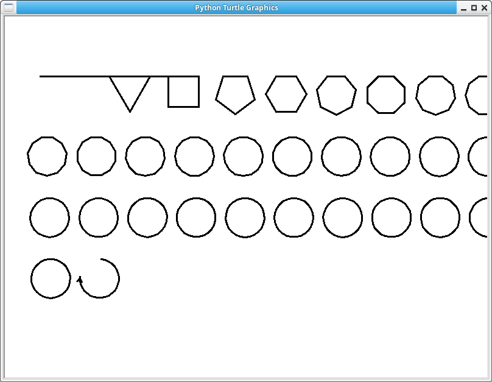

### Shapes with turtle

Draw shapes with Python turtles.
The turtle moves an amount of degrees, which is 360 / no_sides.
That means it starts with a line, then triangle, square, circle etcetera.

Leanr Python:
* https://pythonbasics.org
